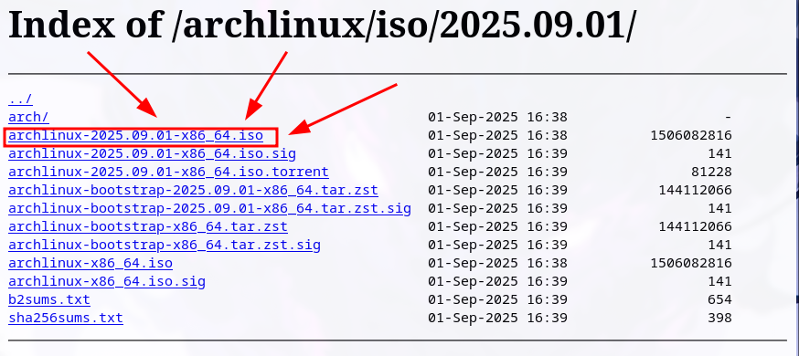
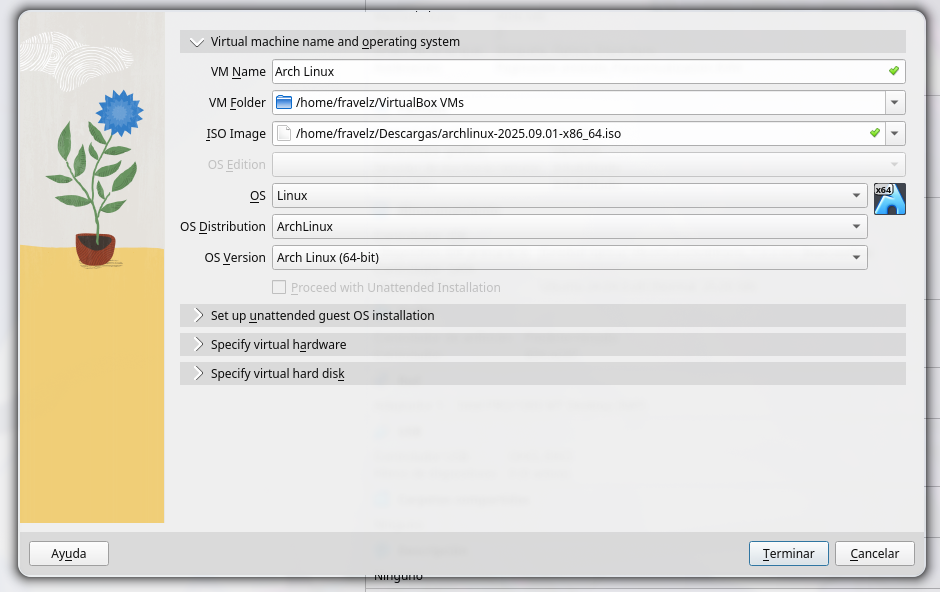

# Instalación de Arch Linux

---

## Temario

Existen varias formas de instalar Arch Linux:

1. [Instalar como Sistema Operativo Principal](#1-instalar-como-sistema-operativo-principal)

2. [Instalar en Máquina Virtual (VirtualBox)](#2-instalar-en-máquina-virtual-virtualbox)

3. [Instalar en Dual Boot](#3-instalar-en-dual-boot)

[Regresar a la guía principal](./../readme.md)

---

## 1. Instalar como Sistema Operativo Principal

Enlace genérico si buscas mejor un video de YouTube: [Ir a Como instalar Arch como Sistema Operativo Principal](https://www.youtube.com/results?search_query=instalar+arch+linux+como+sistema)

---

## 2. Instalar en Máquina Virtual (VirtualBox)

Enlace genérico si buscas mejor un video de YouTube: [Ir a Como instalar Arch en Máquina Virtual](https://www.youtube.com/results?search_query=instalar+arch+linux+en+virtualbox)

### Paso 1: Descargar la imagen ISO

1. Entra a la página oficial de Arch Linux:
   * [Ir a Arch Linux .iso](https://archlinux.org/download/)

2. Busca tu país en la lista de servidores (*mirrors*).

   * Si **tu país no aparece**, elige **el país más cercano** geográficamente.

3. Todos los servidores ofrecen **la misma imagen (.iso)** de Arch Linux. La diferencia está en la **velocidad y estabilidad de descarga**:

   * Cuanto **más cerca esté el servidor**, **más rápida y estable** será la descarga.

   * Si un servidor falla, **otro del mismo país puede seguir funcionando**.

    **Ejemplo:** 

4. Selecciona el archivo `.iso` como se muestra en la siguiente imagen:
  
   

### **Paso 2: Crear la máquina virtual**

1. Abre **VirtualBox** y haz clic en la opción **“Nuevo”**.
   

2. En la ventana que aparece:

   * Escribe el **nombre**: `Arch Linux`
   * Selecciona la **imagen ISO** que descargaste anteriormente.

    

3. Las demás opciones puedes dejarlas con los valores **por defecto**.

### Paso 3: Iniciar la instalación

1. Inicia la máquina virtual que acabas de crear.

2. Al aparecer el menú de inicio, selecciona la **primera opción**.

3. Luego verás una **terminal de instalación**: desde allí comenzarás la instalación de Arch Linux.

---

## 3. Instalar en Dual Boot

Enlace genérico si buscas mejor un video de YouTube: [Ir a Como instalar Arch en Dual Boot](https://www.youtube.com/results?search_query=instalar+arch+linux+en+dual+boot)

---

## Felicitaciones

Si completaste alguno de los métodos anteriores, ¡Felicidades! Has instalado Arch Linux correctamente.

---

[Regresar a la guía principal](./../readme.md)

> **Autor:** Fravelz
